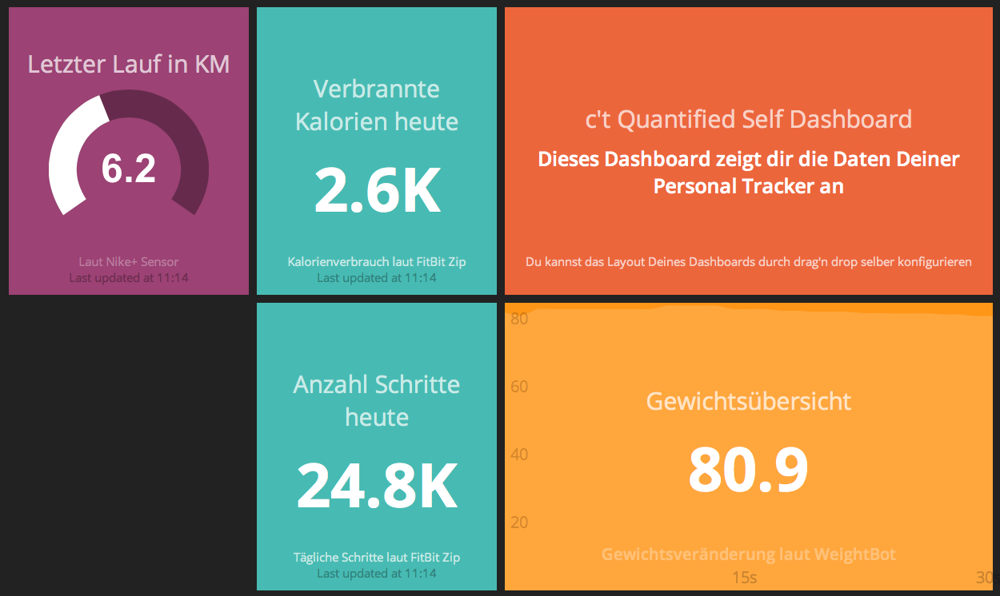

c't Quantify Self Dashboard
===========================

Dieses Dashboard ist im Rahmen eines Artikels für die c't im September 2013 entstanden.
Das Dashboard zeigt Daten eines Nike+ Sensors (http://nikeplus.nike.com/plus/), eines FitBot Zip (http://www.fitbit.com/de/zip) und Gewichitsdaten
der WeighBot-Anwwendung. 

Aus verständlichen Gründen sind die Passwörter und Zugangscodes nicht im Projekt enthalten.
Die Konfigurationsdateien dafür finden sich im Verzeichnis 

<code>
/libs/nikeplus/nikeplus.yml
/libs/fitbit/firbit.yml
/libs/weightbot.yml
</code>

Die Daten der einzelnen Tracker werden mit Hilfe der Ruby-Scheduler-Script unter
<code>
/jobs/nikeplus.rb
/jobs/weightbot.rb
/jobs/fitbit\_calories.rb
/jobs/fitbit\_steps.rb
</code>

geholt. Die Jobs schicken die Daten zu den einzelnen Widgets welche innerhalb
des Dashboards unter

<code>
/dashboard/sample.erb
</code>

implementiert sind.

